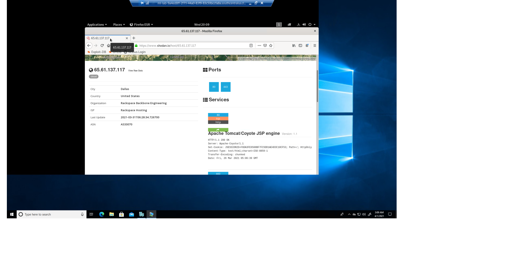
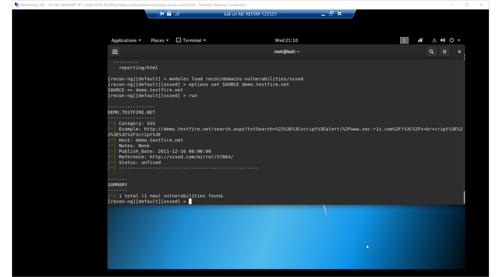
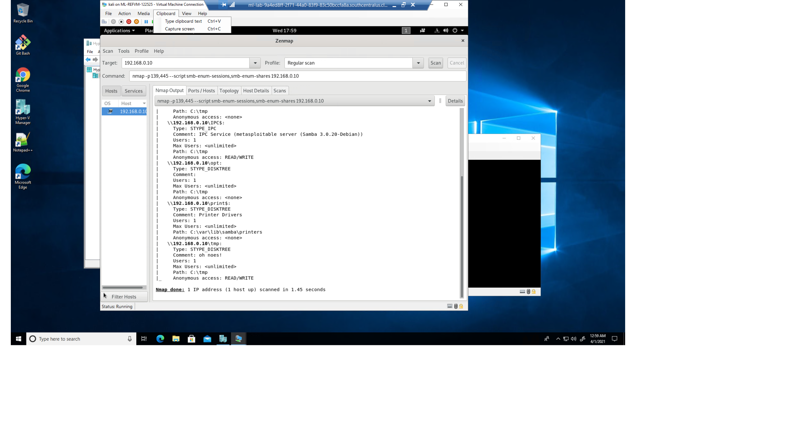

## Week 16 Homework Submission File: Penetration Testing 1

#### Step 1: Google Dorking

- Using Google, can you identify who the Chief Executive Officer of Altoro Mutual is:

   - Karl Fitzgerald

- How can this information be helpful to an attacker:

   - Enabling an attacker to launch an EMAIL whaling phising attack against the CEO of Altoro Mutual

#### Step 2: DNS and Domain Discovery

Enter the IP address for `demo.testfire.net` into Domain Dossier and answer the following questions based on the results:

  1. Where is the company located: 

      - Sunnyvalle, CA

  2. What is the NetRange IP address:

      - 65.61.137.64 - 65.61.137.127

  3. What is the company they use to store their infrastructure:

      - Rackspace 

  4. What is the IP address of the DNS server:

     - 65.61.137.117 

#### Step 3: Shodan

- What open ports and running services did Shodan find:
     
     * Port 80 -  Apache tcp, HTTP
     * Port 443 - Apache tcp ,HTTPS 

 	

#### Step 4: Recon-ng

- Install the Recon module `xssed`. 
- Set the source to `demo.testfire.net`. 
- Run the module. 

Is Altoro Mutual vulnerable to XSS: YES 

 

### Step 5: Zenmap

Your client has asked that you help identify any vulnerabilities with their file-sharing server. Using the Metasploitable machine to act as your client's server, complete the following:

- Command for Zenmap to run a service scan against the Metasploitable machine:

  - nmap -sV 192.168.0.10  
 
- Bonus command to output results into a new text file named `zenmapscan.txt`:

  - nmap -sV -oN zenmapscan.txt

- Zenmap vulnerability script command:

  - nmap  -p 139,445 --script smb-enum-sessions a92.168.0.10 

 

- Once you have identified this vulnerability, answer the following questions for your client:
  1. What is the vulnerability:

     -  The 192.168.0.10\tmp fileshare allows for user Anonymous: READ/WRITE access 

  2. Why is it dangerous:

     -  This could result in a hacker gaining access to the host server and install malicious code .

  3. What mitigation strategies can you recommendations for the client to protect their server:

     -  Professional Pentest Contract to identyify and address current vulnerabilities.
     -  Established  Scheduled application upgrades
     -  Ongoing Removal of old application program versions
     -  Scheduled ongoing OS and application patching
     -  Firewall deployed for external user access

     
---
